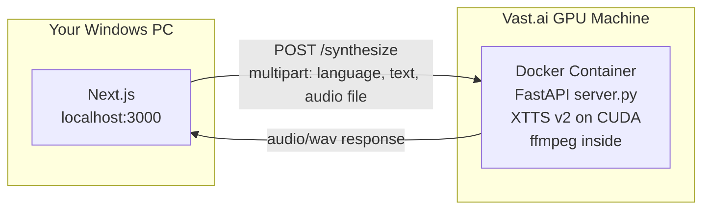

# Coqui XTTS v2 GPU Container + Frontend Integration

## Step 0: Branch

Initialize git repo (workspace is not currently a repo) and create branch:

```bash
git init
git add -A
git commit -m "Initial commit: existing Coqui Next.js app"
git checkout -b coqui-gpu-container
```

All work happens on the `coqui-gpu-container` branch.

## Current State

The existing Next.js app at `d:\Phaneroo IT Dept\voice clonings\coqui` talks to a local `tts-server` process. It sends a **filesystem path** to the reference audio, which means the server and app must share a disk. This fundamentally cannot work with a remote GPU.

## What Changes




The GPU container becomes a self-contained black box. It receives the raw audio file + text over HTTP, does **all** heavy processing internally (reference extraction, text chunking, XTTS inference, concatenation), and returns a single WAV. The Next.js app becomes a thin proxy.

## File Layout

New files at `d:\Phaneroo IT Dept\voice clonings\gpu-services\coqui\` (sibling to existing Next.js app, matching target architecture):

- `**server.py`** -- FastAPI app with two endpoints
- `**Dockerfile`** -- CUDA-based image with ffmpeg + Python deps + pre-downloaded model weights
- `**requirements.txt`** -- `fastapi`, `uvicorn[standard]`, `python-multipart`, `coqui-tts`
- `**docker-compose.yml`** -- at `gpu-services/` level, defines the coqui service with GPU passthrough

Modified files in existing Next.js app (`d:\Phaneroo IT Dept\voice clonings\coqui\`):

- `**lib/coqui.ts**` -- rewrite to send multipart form data (actual file, not a path) to `/synthesize`
- `**app/api/generate/route.ts**` -- simplify to just forward form data to GPU and return the audio response
- `**lib/audio.ts**` -- remove (all ffmpeg/chunking moves into the GPU container)
- `**.env.example**` -- update URL to `http://<gpu-ip>:5001`

---

## 1. GPU Container: `server.py`

Key design decisions:

- **Single endpoint `POST /synthesize`** matching the universal contract: accepts `language` (string), `text` (string), `audio` (file), returns `audio/wav`
- **Model loaded once at startup** into GPU memory via `TTS("tts_models/multilingual/multi-dataset/xtts_v2").to("cuda")`
- **ffmpeg runs inside the container** for reference extraction (trim to 15s, mono, 24kHz) -- same logic currently in `lib/audio.ts` but in Python
- **Text chunking at ~320 chars** (same sentence/word boundary logic currently in `lib/audio.ts`) -- different engines may need different chunk sizes, so this belongs in the container
- **Per-chunk synthesis** using `tts.tts_to_file()` or `tts.tts()` from the Coqui TTS Python API
- **Concatenation via ffmpeg** inside the container
- **Health endpoint `GET /health`** for probing

Pseudostructure of `server.py`:

```python
from fastapi import FastAPI, UploadFile, Form, File
from fastapi.responses import FileResponse
from TTS.api import TTS
import subprocess, tempfile, os

app = FastAPI()
model = None

@app.on_event("startup")
def load_model():
    global model
    model = TTS("tts_models/multilingual/multi-dataset/xtts_v2", gpu=True)

@app.get("/health")
def health():
    return {"status": "ok", "model": "xtts_v2", "gpu": True}

@app.post("/synthesize")
async def synthesize(
    language: str = Form(...),
    text: str = Form(...),
    audio: UploadFile = File(...)
):
    # 1. Save upload to temp file
    # 2. ffmpeg: extract first 15s, mono, 24kHz → reference.wav
    # 3. Chunk text at ~320 char boundaries
    # 4. For each chunk: model.tts_to_file(text=chunk, speaker_wav=ref, language=lang)
    # 5. ffmpeg: concatenate chunk WAVs → output.wav
    # 6. Return output.wav as audio/wav
    # 7. Cleanup temp files
```

## 2. GPU Container: `Dockerfile`

```dockerfile
FROM pytorch/pytorch:2.1.0-cuda12.1-cudnn8-runtime

RUN apt-get update && apt-get install -y --no-install-recommends ffmpeg && rm -rf /var/lib/apt/lists/*

WORKDIR /app
COPY requirements.txt .
RUN pip install --no-cache-dir -r requirements.txt

# Pre-download model weights into the image (avoids download on every container start)
RUN python -c "from TTS.api import TTS; TTS('tts_models/multilingual/multi-dataset/xtts_v2')"

COPY server.py .

EXPOSE 5001
CMD ["uvicorn", "server:app", "--host", "0.0.0.0", "--port", "5001"]
```

Image size will be ~8-12 GB (PyTorch + CUDA + model weights). Build once, reuse.

Alternative: skip the model pre-download in the Dockerfile and instead mount a `models/` volume so weights persist across container restarts without bloating the image. This is better for Vast.ai where you pay for disk:

```yaml
volumes:
  - ./models:/root/.local/share/tts
```

## 3. `docker-compose.yml`

At `gpu-services/docker-compose.yml`:

```yaml
services:
  coqui:
    build: ./coqui
    ports:
      - "5001:5001"
    volumes:
      - ./models:/root/.local/share/tts
    deploy:
      resources:
        reservations:
          devices:
            - driver: nvidia
              count: 1
              capabilities: [gpu]
```

Run with `docker compose up coqui`. Only starts the coqui container. Add more services later as you build them.

## 4. Next.js Changes

`**lib/coqui.ts**` -- rewrite to:

- Send `POST /synthesize` with `Content-Type: multipart/form-data`
- Body: `language`, `text`, `audio` (the raw File object, not a path)
- Receive `audio/wav` buffer back
- Remove all the `speaker-wav` path logic

`**app/api/generate/route.ts**` -- simplify to:

- Parse incoming form data (language, text, audio) -- keep Zod validation
- Forward all three fields as multipart to the GPU container's `/synthesize`
- Stream/return the WAV response directly
- Remove all ffmpeg, chunking, and concatenation calls

`**lib/audio.ts**` -- delete or gut. All ffmpeg processing and chunking now lives in `server.py`.

`**.env.example**` -- update:

```
COQUI_URL=http://localhost:5001
COQUI_REQUEST_TIMEOUT_MS=180000
```

## 5. Vast.ai Deployment Flow

1. Rent a GPU instance (RTX 4090, 24GB VRAM, ~20-30GB disk)
2. SSH in: `ssh -p <port> root@<ip>`
3. Copy code: `scp -P <port> -r gpu-services/coqui root@<ip>:/workspace/`
4. Build: `docker build -t coqui-tts .` (or `docker compose up coqui`)
5. First run downloads model weights (~2-4 GB), cached in volume for subsequent runs
6. Container listens on `:5001`, Vast.ai exposes it at `http://<ip>:5001`
7. On your PC: set `COQUI_URL=http://<vast-ip>:5001` in `.env.local`
8. Run `npm run dev`, open `localhost:3000`, use as before

When done: stop container, destroy Vast.ai instance. Code stays on your PC/GitHub. Next rental: re-upload code, model weights re-download (or use persistent volume at ~$0.01/hr to skip).

## 6. What Downloads Where

- **On the Vast.ai machine's internet (not yours):** Docker base image (~~3 GB), Python packages (~~2 GB), XTTS v2 model weights (~4 GB). All downloaded when you run `docker build` or first start the container.
- **On your PC's internet:** only SSH traffic, your code files via `scp` (a few KB), and audio files sent to/from `/synthesize` during use.
- **Model weights location inside the container:** `/root/.local/share/tts/`. Mounted to a host volume (`./models`) so they persist across container restarts.
- **Nothing heavy downloads to your Windows PC.** Your PC only holds the Next.js app and the `gpu-services/` code (small Python files + Dockerfiles).

## 7. GPU Selection Criteria (Vast.ai)

When picking a machine, check these in order:

- **VRAM** -- XTTS v2 needs ~6 GB. 12 GB works, 24 GB is future-proof. Don't overpay for 48 GB.
- **CUDA version** -- must be >= 12.1 (what the Dockerfile uses). Higher is fine (backward compatible).
- **Disk** -- allocate 25-30 GB minimum (Docker image + model weights + temp audio files).
- **Verified host + reliability** -- always pick verified hosts. Aim for 99%+ reliability.
- **Price** -- $0.20-0.40/hr is typical for a 4090. Stop instances when idle.
- **Network** -- anything above 1 Gbps is fine. Your home internet will be the real bottleneck.

Ignore TFLOPS, memory bandwidth, SSD speed, DLPerf score -- irrelevant for TTS inference.

## 8. Cost Management

You are charged the entire time the Vast.ai instance is running, whether you use it or not.

- **Write and test all code locally first.** No GPU needed for writing Python/TypeScript.
- **Only rent when ready to deploy.** Code is done, you just need to build + test.
- **Keep sessions short.** Rent -> SSH -> upload -> build -> test -> destroy.
- **If you find a bug:** destroy the instance, fix on your PC, rent again.
- **Never leave an instance running overnight.** At $0.32/hr, 8 hours idle = $2.56 wasted.
- **Use a persistent volume** (~$0.01/hr) if you want model weights to survive between rentals, avoiding the ~4 GB re-download each time.

